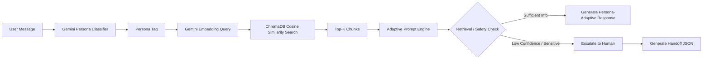

# Persona-Adaptive Customer Support Agent

A complete Adsparkx AI assignment implementation using **Google Gemini**, **ChromaDB**, **RAG**, **persona-aware response generation**, and **human escalation**.

## Project Overview

This support agent detects the customer's communication persona, retrieves relevant support documentation, generates a grounded answer in the correct tone, and escalates unsafe or unresolved issues to a human representative with a structured JSON handoff.

Supported personas:

- Technical Expert
- Frustrated User
- Business Executive

## Core Workflow



## Tech Stack

- Python 3.11+
- `google-genai` for Gemini chat + embeddings
- `text-embedding-004` for semantic vectors
- `chromadb` persistent local vector database
- `langchain` RecursiveCharacterTextSplitter
- `pypdf` for PDF parsing
- `streamlit` clean web UI
- `python-dotenv` for environment variables

## Repository Structure

```text
persona-support-agent-gemini/
├── data/
│   ├── api_troubleshooting.md
│   ├── billing_policy.txt
│   ├── password_reset_guide.pdf
│   └── ...
├── src/
│   ├── __init__.py
│   ├── config.py
│   ├── classifier.py
│   ├── rag_pipeline.py
│   ├── generator.py
│   ├── escalator.py
│   ├── agent.py
│   └── utils.py
├── scripts/
│   └── ingest.py
├── tests/
├── app.py
├── cli.py
├── requirements.txt
├── .env.example
├── .gitignore
└── README.md
```

## Setup Instructions

```bash
python -m venv .venv
source .venv/bin/activate  # Windows: .venv\Scripts\activate
pip install -r requirements.txt
cp .env.example .env
```

Add your Gemini key in `.env`:

```env
GEMINI_API_KEY="your_actual_gemini_api_key_here"
```

## Build the Vector Index

```bash
python scripts/ingest.py
```

This parses documents from `data/`, chunks them with LangChain, embeds them with Gemini `gemini-embedding-2`, and stores them in persistent ChromaDB.

## Run the Streamlit UI

```bash
streamlit run app.py
```

## Run CLI

```bash
python cli.py
```

## Persona Detection Strategy

The classifier uses Gemini structured JSON output with a strict schema:

```json
{
  "persona": "Technical Expert",
  "confidence": 0.91,
  "reasoning": "The user mentions bearer token auth and HTTP headers."
}
```

A rule-based fallback is included so the app can still demonstrate persona labels if the Gemini classification call fails.

## RAG Pipeline Design

- Documents are loaded from `data/`.
- TXT and Markdown are read directly.
- PDF files are parsed page-by-page using `pypdf`.
- Text is split using `RecursiveCharacterTextSplitter` with configurable chunk size and overlap.
- Chunks are embedded using Gemini `gemini-embedding-2`.
- ChromaDB stores embeddings, chunk text, source file, page/section, and chunk index.
- Queries are embedded with the same model and searched using cosine similarity.

## Escalation Logic

Escalation triggers:

1. No relevant document chunks retrieved.
2. Retrieval confidence below `CONFIDENCE_THRESHOLD`.
3. Sensitive topics such as billing, refunds, legal, account ownership, data export, or security breach.
4. Repeated dissatisfaction across conversation turns.
5. Explicit request for a human/manager/escalation.

When escalation occurs, the app generates handoff JSON containing:

- Persona
- Persona reasoning
- User issue
- Conversation history
- Retrieved sources
- Confidence score
- Escalation reason
- Attempted steps
- Recommended human action

## Example Queries

```text
Where is the guide to clear cookies? It's been an hour and nothing is loading on your interface!
What are the header parameter requirements for your bearer token auth implementation?
Our operational uptime is decreasing. We need a timeline of when billing disputes are resolved.
I'm experiencing an issue with your database integration that's causing internal errors.
My billing statement has unexpected duplicate charges. I demand an immediate refund!
```

## Screen Recording Plan

For a 3–5 minute demo:

1. Show repository structure.
2. Show `data/` with the required PDF.
3. Run `python scripts/ingest.py`.
4. Launch `streamlit run app.py`.
5. Test all three personas.
6. Show retrieved sources and confidence scores.
7. Trigger billing/refund escalation.
8. Explain one design decision: persistent ChromaDB avoids re-embedding on every chat turn.

## Deployment

You can deploy this on Streamlit Community Cloud, Render, Railway, or any VM. Add `GEMINI_API_KEY` as a secret/environment variable. For Streamlit Cloud, use the repository root and set the entry file to `app.py`.

## Known Limitations

- Gemini classification is powerful, but a production system should log and audit classification errors.
- ChromaDB is local; production systems may use Qdrant, Pinecone, Weaviate, or a managed vector database.
- The UI does not implement authentication or ticket creation APIs.
- Evaluation metrics such as faithfulness scoring and retrieval precision can be added later.
